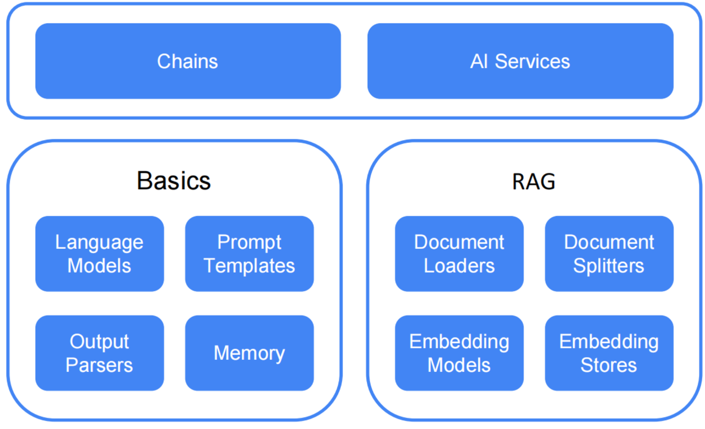
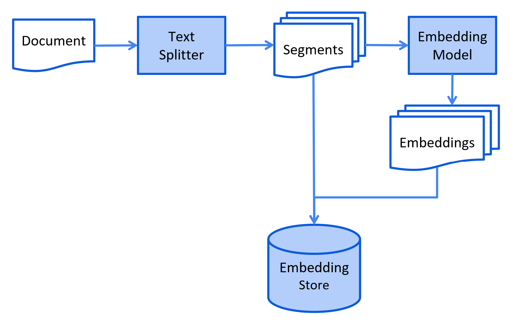
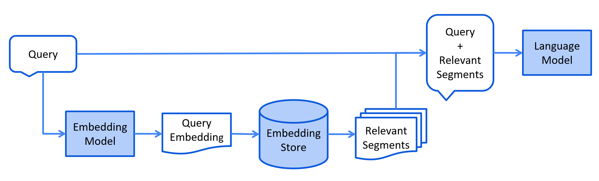
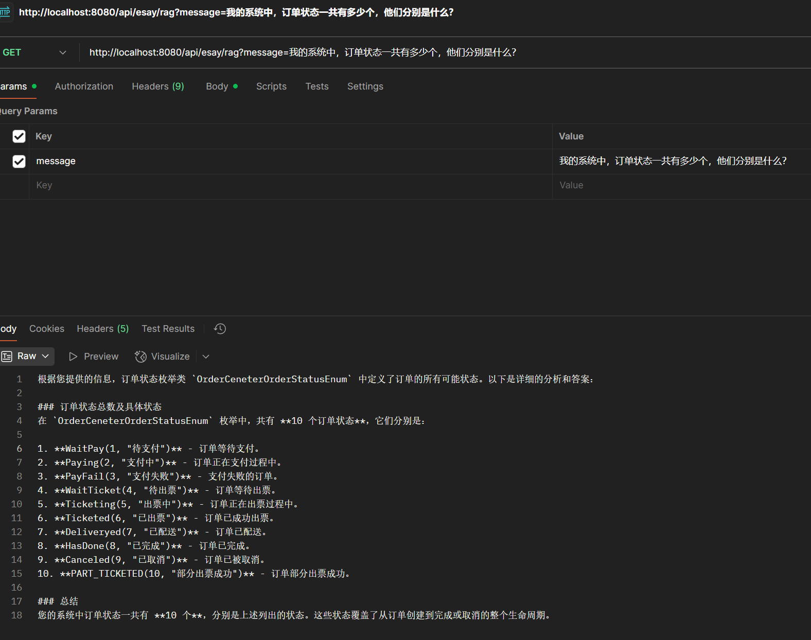

# Conch-AI
AI SpringAI Langchain4j Deepseek RAG MCP

LangChain4j：https://github.com/langchain4j

## 什么是LangChain
LangChain是一套非常适合基于AI大模型开发生成式应用的工具集，为各种大模型提供了一个统一的抽象层

### Models
Models是LangChain中用于生成文本或执行其他任务的AI模型，通常是预训练的语言模型（如GPT-3、GPT-4等）， 用于生成文本、回答问题、翻译、总结等任务。LangChain允许你通过API调用这些模型，并将它们集成到更复杂的应用中。
- ChatModel

  这些接受多个ChatMessage作为输入，并返回一个单独的AiMessage作为输出。ChatMessage通常包含文本，但一些LLMs也支持其他模态（例如，图像、音频等）。此类聊天模型的例子包括OpenAI的gpt-4o-mini和Google的gemini-1.5-pro

- EmbeddingModel

  这个模型可以将文本转换为Embedding

- ImageModel

  这个模型可以生成和编辑图像

- ModerationModel

  这个模型可以检查文本是否包含有害内容

- ScoringModel

  这个模型可以针对查询的多个文本片段进行评分（或排名），本质上确定每个文本片段与查询的相关性。这对于RAG很有用。这些内容将在以后进行介绍。

### Prompts
Prompts是用户提供给模型的输入文本，用于引导模型生成特定的输出。Prompts可以是简单的文本，也可以是结构化的模板。Prompts用于控制模型的输出，使其生成符合预期的结果。通过设计好的Prompts，可以引导模型执行特定的任务，如问答、翻译、生成代码等。

### Vector Store
Vector Store是用于存储和检索文本向量的数据库。文本向量是通过将文本嵌入到高维空间中生成的数值表示。Vector Store用于快速检索与查询文本相似的文本片段。这在文档检索、推荐系统、语义搜索等任务中非常有用。

### Document Loaders
Document Loaders是用于从不同来源（如文件、数据库、API等）加载文档的工具。Document Loaders用于将外部数据加载到LangChain中，以便进一步处理。例如，可以从PDF、Word文档、网页等加载文本数据。

### Text Splitters
Text Splitters用于将长文本分割成较小的片段或块。Text Splitters用于处理长文本，使其适合模型的输入长度限制。这在处理大型文档或长篇文章时非常有用，可以确保模型能够处理整个文本。

### Output Parsers
Output Parsers用于将模型的输出解析为结构化数据或特定格式。Output Parsers用于处理模型的原始输出，将其转换为更易用的格式，如JSON、字典、列表等。这对于后续的数据处理和分析非常有用。

### Tools
Tools是LangChain中用于执行特定任务的函数或接口。它们可以是内置的工具，也可以是自定义的工具。Tools用于扩展模型的能力，例如调用外部API、执行计算、查询数据库等。通过Tools，模型可以与环境进行交互，执行更复杂的任务。

## LangChain工程结构

## Chat
- ChatModel

  这些接受多个ChatMessage作为输入，并返回一个单独的AiMessage作为输出。ChatMessage通常包含文本，但一些LLMs也支持其他模态（例如，图像、音频等）。此类聊天模型的例子包括OpenAI的gpt-4o-mini和Google的gemini-1.5-pro

- UserMessage：

  这是一条来自用户的消息。用户可以是您应用程序的最终用户（人类）或者您的应用程序本身。根据LLM支持的模态，用户消息可以包含纯文本（字符串）或其他模态。

- AiMessage：
  
  这是一条由AI生成的消息，通常是对用户消息的响应。如您所注意到的，generate方法返回的是一个包含在Response中的AI消息。AI消息可以包含文本响应（字符串）或执行工具的请求（ToolExecutionRequest）。我们将在另一节中探讨工具。
  
- ToolExecutionResultMessage：

  这是ToolExecutionRequest的结果。

- SystemMessage：

  这是一条来自系统的消息。通常，您作为开发者应该定义这条消息的内容。
  通常，您会在这里写下关于LLM在这次对话中的角色、它应该如何表现、应该以何种风格回答等的说明。LLM被训练成比其他类型的消息更关注系统消息，所以请小心，最好不要让最终用户自由定义或注入某些输入到系统消息中。通常，它位于对话的开始。

- CustomMessage：

  这是一种可以包含任意属性的自定义消息。这种消息类型只能由支持它的ChatModel实现使用（目前只有Ollama）

- TokenUsage：

  ChatResponse also contains ChatResponseMetadata. ChatResponseMetadata contains TokenUsage,
  which contains stats about how many tokens the input (all the ChatMessages that you provided to the generate method) contained,
  how many tokens were generated as output (in the AiMessage), and the total (input + output)

- FinishReason：

  which is an enum with various reasons why generation has stopped. Usually, it will be FinishReason.STOP, if the LLM decided to stop generation itself.

- Multiple ChatMessages：

  大模型是无状态的，如果需要进行多轮对话，就需要管理对话信息

- ChatMemory:

  手动管理多个messages很繁琐（cumbersome）, 所以利用ChatMemory进行管理

  Langchain4j内置了两个chatMemory的实现

  1. MessageWindowChatMemory
  2. TokenWindowChatMemory

  基于ChatMemoryStore重新实现会话记忆的存储：可自定义实现方式

- 会话隔离

  - 利用MemoryId进行会话隔离

- MultiModality：多模态

  UserMessage 可以包含多种类型的内容：

  TextContent：文本内容

  - ImageContent：  图片可以是链接，也可以是Base64-encoded二进制数据，这取决于你底层的大模型能力
  - AudioContent：  与ImageContent相似
  - VideoContent：  与ImageContent相似
  - PdfFileContent：  与ImageContent相似

## RAG

### Indexing

### Retrieval

测试：

